# User Experience Design - School Management System

## Overview
Comprehensive user experience design for a desktop school management application built with React + Tauri, featuring role-based interfaces, intuitive navigation, and efficient workflows for educational institution management.

## Application Architecture

### Technology Stack
- **Frontend Framework:** React 18+ with TypeScript
- **Desktop Framework:** Tauri (Rust-based)
- **UI Framework:** Material-UI (MUI) or Ant Design
- **State Management:** Redux Toolkit or Zustand
- **Routing:** React Router v6
- **Forms:** React Hook Form with Yup validation
- **Charts/Analytics:** Chart.js or Recharts
- **Date Management:** Day.js or date-fns

### Desktop Application Benefits
- **Native Performance:** Fast, native desktop experience
- **Offline Capability:** Local database with sync capabilities
- **Security:** No browser vulnerabilities, secure local storage
- **System Integration:** Native file system access for backups
- **LAN Distribution:** Easy deployment across school network

## User Roles & Access Levels

### 1. Director (مدير)
- **Full System Access:** Complete administrative control
- **Dashboard:** Comprehensive analytics and overview
- **Password Management:** Can reset all user passwords
- **Data Export:** Full reporting and backup access
- **Note-taking System:** Notion-like interface for documentation

### 2. Finance Officer (صندوق)
- **Financial Management:** Complete finance module access
- **Student Payments:** Payment tracking and receipt generation
- **Expense Management:** Budget and expense tracking
- **Financial Reports:** Revenue and expense analytics
- **Teacher Salaries:** Automatic calculation based on hours

### 3. Morning School Staff (مدرسة صباحي)
- **Student Management:** Morning session students
- **Teacher Management:** Morning session teachers
- **Schedule Management:** Morning session schedules
- **Activity Management:** Morning session activities
- **Academic Records:** Grade and attendance management

### 4. Evening School Staff (مدرسة مسائي)
- **Student Management:** Evening session students
- **Teacher Management:** Evening session teachers
- **Schedule Management:** Evening session schedules
- **Activity Management:** Evening session activities
- **Academic Records:** Grade and attendance management

## Application Flow & Navigation

### 1. Initial Setup & Academic Year Selection


#### Enhanced Academic Year Setup Interface
- **Year Format:** Visual input with format example (2025-2026) and validation
- **Description Field:** Optional description or theme for the year
- **Advanced Data Migration Options:**
  ```
  ┌── Copy Previous Year Data ──┐
  │ ☑ Copy School Structure (Classes, Subjects, Schedule Constraints)     │
  │ ☑ Copy Teacher Information (with employment status confirmation)    │
  │ ☑ Promote Students to Next Grade                                  │
  │   ├─ ☑ Automatic Grade Advancement (Primary 1→2, 2→3, etc.)       │
  │   ├─ ☑ Handle Graduating Students (Mark as Alumni)               │
  │   ├─ ☑ Handle Failed Students (Keep in same grade)              │
  │   └─ ☑ Reset Academic Records (Grades, Attendance)             │
  │ ☑ Copy Financial Structure (Fee schedules, categories)            │
  │ ☐ Copy Student Financial Balances (carry over dues)               │
  └──────────────────────────────────────────────────────────────────────┘
  ```
- **Smart Student Progression Logic:**
  ```
  Primary Students (Grades 1-6):
  • Grade 6 → Intermediate Grade 1 (if configured)
  • Grade 6 → Alumni Status (if no intermediate)
  
  Intermediate Students (Grades 1-3):
  • Grade 3 → Secondary Grade 1 (if configured)
  • Grade 3 → Alumni Status (if no secondary)
  
  Secondary Students (Grades 1-3):
  • Grade 3 → Alumni Status (graduation)
  
  Special Cases:
  • Failed Students: Remain in current grade
  • Transferred Students: Mark as inactive
  • Special Needs: Manual review required
  ```
- **Financial Data Migration:**
  - Option to carry forward unpaid balances
  - Reset payment schedules for new year
  - Maintain payment history from previous years
  - Update fee structures for inflation
- **Teacher Employment Status Review:**
  - Confirm returning teachers
  - Mark non-returning teachers as inactive
  - Update teacher qualifications and subjects
  - Reset attendance records
- **Validation & Confirmation:**
  - Preview migration summary before execution
  - Rollback option if errors occur
  - Detailed migration log for audit
  - Email/Telegram notification upon completion

### 2. Role-Based Authentication


#### Enhanced Authentication Interface Design
- **Role Cards:** Large, visually distinct cards for each role with icons and descriptions
- **Password Security:** 
  - Masked input with show/hide toggle
  - Password strength indicator (weak/medium/strong)
  - Real-time validation feedback
- **Remember Me:** Session persistence option (24 hours default, configurable)
- **Enhanced Forgot Password System:**
  ```
  1. User clicks "Forgot Password" → System generates secure 12-character password
  2. Telegram notification sent to director with:
     - User role and username
     - New temporary password
     - Timestamp of reset
     - Security warning
  3. User logs in with temporary password
  4. FORCED password change on first login
  5. Temporary password expires in 24 hours
  6. All resets logged for audit
  ```
- **Default Password Recovery:**
  - Only director has emergency access to reset any password
  - Director receives immediate notifications for all password resets
  - Complete audit trail maintained
  - Emergency bypass available for director account (physical access required)
- **Password Requirements:**
  - Minimum 8 characters
  - Must include uppercase, lowercase, and numbers
  - Cannot reuse last 3 passwords
  - Automatic expiry after 90 days (configurable)

### 3. Director Dashboard - Notion-like Interface

#### Main Navigation Structure
```
┌─ Dashboard Overview
├─ 📁 Goals (أهداف)
├─ 📁 Projects (مشاريع)
├─ 📁 Blogs (مدونات)
├─ 📁 Notes (ملاحظات)
├─ 📁 Educational & Administrative (امور خاصة تعليمية و ادارية)
├─ 💰 Rewards Management (المكافئات)
├─ 🤝 Assistance Records (المساعدات)
└─ 📊 System Analytics
```

#### Folder Interface Design
- **Folder Icons:** Large, intuitive folder representations
- **Note Creation:** Plus button for new notes
- **Note Template:**
  ```
  Title: [Input Field]
  Date: [Auto-filled, editable]
  Content: [Rich text editor]
  ```
- **Search & Filter:** Quick search across all notes
- **Tag System:** Categorization and organization

#### Dashboard Analytics
- **Financial Overview:** Income vs. expenses visualization
- **Student Statistics:** Enrollment trends, grade distribution
- **Teacher Analytics:** Attendance, performance metrics
- **Activity Participation:** Engagement statistics
- **System Health:** Database status, backup information

### 4. Finance Module Interface

#### Main Finance Dashboard


#### Financial Overview Cards
1. **School Balance (رصيد المدرسة)**
   - Current available funds
   - Click to view detailed transactions

2. **Outstanding Receivables (مبالغ مستحقة للمدرسة)**
   - Unpaid tuition and fees
   - Click to view student-specific details

3. **Outstanding Payables (مبالغ مستحقة على المدرسة)**
   - Unpaid teacher salaries and expenses
   - Click to view creditor details

#### Student Payment Interface
- **Search Functionality:** Type 3 characters, get suggestions
- **Payment History:** Comprehensive transaction log
- **Receipt Generation:** Automatic receipt number assignment
- **Balance Calculation:** Real-time balance updates
- **Payment Plans:** Installment tracking

### 5. School Management Interface (Morning/Evening)

#### Main School Dashboard

```mermaid
graph TB
    A[School Session Selection] --> B[Morning/Evening]
    B --> C[Main Menu]
    
    C --> D[👥 Students]
    C --> E[👨‍🏫 Teachers]
    C --> F[🎯 Activities]
    C --> G[ℹ️ School Information]
    C --> H[📅 Schedule Generation]
```


#### Student Management
- **Quick Add Student:** Streamlined enrollment form
- **Advanced Search:** Multiple criteria filtering
- **Profile Management:** Comprehensive student profiles
- **Grade Management:** Subject-wise grade entry
- **Attendance Tracking:** Daily attendance recording
- **Parent Communication:** Contact information management

#### Teacher Management
- **Teacher Profiles:** Personal and professional information
- **Subject Assignment:** Multi-subject, multi-class assignments
- **Schedule Management:** Availability and assignment tracking
- **Attendance Recording:** Daily attendance with extra hours
- **Performance Analytics:** Teaching load and statistics

#### Enhanced Schedule Generation Interface
- **Advanced Constraint Setup:**
  ```
  ┌── Schedule Constraints Configuration ──┐
  │                                               │
  │ 🚫 FORBIDDEN CONSTRAINTS:                   │
  │ • Subject [Math] → Cannot be in Period [1] on [Monday]   │
  │ • Subject [PE] → Cannot be after Period [6]              │
  │ • Class [Grade 10] → No classes on [Friday Period 7]     │
  │                                               │
  │ ✅ REQUIRED CONSTRAINTS:                    │
  │ • Subject [Arabic] → Must be in [Morning Periods 1-4]    │
  │ • Subject [Assembly] → Must be [Monday Period 1]         │
  │ • Class [Grade 12] → Must have [Math] daily             │
  │                                               │
  │ ⛔ CONSECUTIVE CONSTRAINTS:                 │
  │ • Subject [Math] → Maximum [1] consecutive period       │
  │ • Subject [Science] → No back-to-back periods           │
  │ • Subject [PE] → Must have [2] consecutive periods      │
  └───────────────────────────────────────────────┘
  ```
- **Visual Constraint Builder:**
  - Drag-and-drop interface for setting constraints
  - Color-coded constraint types (Red=Forbidden, Green=Required, Orange=Consecutive)
  - Real-time conflict detection while building constraints
  - Template library for common constraint patterns
- **AI-Powered Schedule Generation:**
  - Genetic algorithm for optimal schedule creation
  - Considers teacher availability, room capacity, and all constraints
  - Multiple solution options with quality scoring
  - Automatic conflict resolution suggestions
- **Manual Schedule Editor:**
  - Drag-and-drop schedule modification
  - Real-time conflict highlighting
  - Undo/redo functionality
  - Side-by-side view (teacher schedule vs. class schedule)
- **Validation & Optimization:**
  - Pre-generation constraint validation
  - Teacher workload balancing
  - Classroom utilization optimization
  - Student break time considerations
- **Export & Integration:**
  - Multiple format exports (PDF, Excel, iCal)
  - Print-optimized layouts for wall posting
  - Mobile-friendly teacher schedule views
  - Integration with school bell system

### 6. Activity Management System

#### Activity Creation Workflow


#### Activity Interface Features
- **Visual Calendar:** Activity scheduling calendar
- **Participant Management:** Class and individual selection
- **Cost Tracking:** Revenue and expense tracking
- **Photo Gallery:** Activity documentation
- **Automatic Notifications:** Student activity participation updates

## User Interface Design Principles

### 1. Responsive Design
- **Desktop Optimized:** Designed for desktop/laptop screens
- **Minimum Resolution:** 1366x768 support
- **Scaling:** Support for high-DPI displays
- **Keyboard Navigation:** Full keyboard accessibility

### 2. Visual Design System

#### Color Scheme
```css
:root {
  /* Primary Colors */
  --primary-blue: #1976D2;
  --primary-light: #42A5F2;
  --primary-dark: #1565C0;
  
  /* Secondary Colors */
  --secondary-green: #388E3C;
  --secondary-light: #66BB6A;
  --secondary-dark: #2E7D32;
  
  /* Status Colors */
  --success: #4CAF50;
  --warning: #FF9800;
  --error: #F44336;
  --info: #2196F3;
  
  /* Neutral Colors */
  --gray-50: #FAFAFA;
  --gray-100: #F5F5F5;
  --gray-500: #9E9E9E;
  --gray-900: #212121;
}
```

#### Typography
- **Primary Font:** 'Cairo', 'Roboto', sans-serif
- **Arabic Support:** Full RTL text support
- **Font Sizes:** Consistent scale (12px, 14px, 16px, 18px, 24px, 32px)
- **Font Weights:** 400 (regular), 500 (medium), 600 (semi-bold), 700 (bold)

#### Component Library
- **Buttons:** Consistent styling across all actions
- **Forms:** Standardized input fields and validation
- **Cards:** Information containers with shadows
- **Tables:** Sortable, filterable data tables
- **Modals:** Consistent dialog patterns

### 3. Navigation Patterns

#### Breadcrumb Navigation
```
Home > Students > Grade 10 > Section A > Ahmed Hassan
```

#### Sidebar Navigation
- **Collapsible Sidebar:** Space-efficient navigation
- **Role-based Menu:** Dynamic menu items based on user role
- **Active State:** Clear indication of current page
- **Search Integration:** Global search functionality

#### Tab Navigation
- **Primary Tabs:** Major section navigation
- **Secondary Tabs:** Subsection navigation
- **Tab Persistence:** Maintain tab state across sessions

## Advanced Features & Interactions

### 1. Enhanced Smart Search & Autocomplete
- **3-Character Trigger Search:** 
  ```
  User Types: "احم" → System shows:
  - أحمد محمد علي (Student - Grade 10A)
  - أحمد سعد محمود (Teacher - Math)
  - أحمد فارس (Former Student - 2023)
  - أحمد النجار (Teacher - Science)
  ```
- **Cross-System Search:** Works across students, teachers, and historical records
- **Smart Filtering:**
  - Shows current students/teachers first
  - Then shows former/transferred individuals
  - Indicates status (Current/Former/Transferred)
  - Shows relevant details (grade, subject, year)
- **Search Implementation:**
  ```javascript
  // Triggered after 3 characters
  const searchResults = {
    current_students: [...],
    former_students: [...],
    current_teachers: [...],
    former_teachers: [...]
  }
  ```
- **Result Display:**
  - Grouped by category (Students/Teachers)
  - Status indicators (✅ Active, ⏸️ Former, ➡️ Transferred)
  - Quick actions (View Profile, Add Payment, etc.)
- **Global Search:** Available in header with keyboard shortcut (Ctrl+K)
- **Recent Items:** Quick access to recently viewed profiles
- **Saved Searches:** Bookmark frequently used search queries
- **Advanced Search Modal:** Opens with detailed filters when needed

### 2. Data Export & Reporting
- **Multiple Formats:** PDF, Excel, CSV export
- **Custom Reports:** User-defined report templates
- **Scheduled Reports:** Automatic report generation
- **Print Optimization:** Print-friendly layouts

### 3. Notification System
- **In-app Notifications:** Important updates and alerts
- **Toast Messages:** Success/error feedback
- **System Status:** Connection and sync status
- **Activity Feed:** Recent system activities

### 4. Backup & Sync Interface
- **Backup Status:** Visual backup status indicator
- **Manual Backup:** One-click backup creation
- **Restore Options:** Backup restoration interface
- **Sync Status:** LAN sync status and controls

## Mobile Responsiveness (Future Enhancement)

### Tablet Support
- **Landscape Mode:** Optimized for tablet landscape
- **Touch Interactions:** Touch-friendly interface elements
- **Gesture Support:** Swipe and pinch gestures

### Phone Companion
- **Quick Actions:** Essential functions on mobile
- **Notification Access:** Important alerts on mobile
- **Attendance Entry:** Mobile attendance marking

## Accessibility Features

### 1. Keyboard Navigation
- **Tab Order:** Logical tab sequence
- **Keyboard Shortcuts:** Common action shortcuts
- **Focus Indicators:** Clear focus visualization

### 2. Screen Reader Support
- **ARIA Labels:** Comprehensive labeling
- **Semantic HTML:** Proper HTML structure
- **Alt Text:** Image descriptions

### 3. Language Support
- **RTL Support:** Right-to-left text layout
- **Font Selection:** Arabic-friendly fonts
- **Translation Ready:** Internationalization support

## Performance Optimization

### 1. Loading States
- **Skeleton Loading:** Content placeholders during load
- **Progressive Loading:** Load critical content first
- **Lazy Loading:** Load images and components on demand

### 2. Data Management
- **Pagination:** Efficient large dataset handling
- **Virtual Scrolling:** Performance for large lists
- **Caching:** Client-side data caching

### 3. Error Handling
- **Graceful Degradation:** Fallback for missing features
- **Error Boundaries:** Prevent app crashes
- **Retry Mechanisms:** Automatic retry for failed operations

## User Onboarding & Help

### 1. First-time Setup Wizard
- **Step-by-step Guide:** Initial system configuration
- **Sample Data:** Demo data for learning
- **Video Tutorials:** Embedded help videos

### 2. Contextual Help
- **Tooltips:** Inline help for complex features
- **Help Panel:** Contextual documentation
- **FAQ Integration:** Common questions and answers

### 3. User Training
- **Interactive Tour:** Feature discovery tour
- **Training Mode:** Practice environment
- **Documentation Hub:** Comprehensive user guides

This user experience design ensures an intuitive, efficient, and comprehensive interface for all stakeholders in the school management system, with careful attention to Arabic language support, educational workflows, and desktop application advantages.