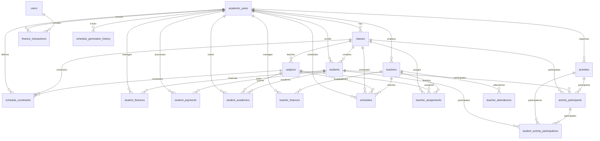

# School Management System - Database Schema

## Overview

This document provides a comprehensive overview of the database schema for the School Management System. The system uses SQLite as its database and follows a normalized relational structure to efficiently store and manage all school-related data.

## Database Structure

The database consists of 12 main tables organized into logical modules:

1. **Core System Tables**
   - Users
   - System Settings
   - Logs and Audits

2. **Academic Management Tables**
   - Academic Years
   - Classes
   - Subjects

3. **Student Management Tables**
   - Students
   - Student Finances
   - Student Payments
   - Student Academic Records

4. **Teacher Management Tables**
   - Teachers
   - Teacher Assignments
   - Teacher Attendance
   - Teacher Finances

5. **Schedule Management Tables**
   - Schedules
   - Schedule Constraints
   - Constraint Templates
   - Schedule Generation History

6. **Finance Management Tables**
   - Finance Categories
   - Finance Transactions

7. **Activities Management Tables**
   - Activities
   - Activity Participants
   - Student Activity Participation

8. **Director Dashboard Tables**
   - Director Notes
   - Rewards
   - Assistance Records

## Detailed Table Schema

### 1. Users Table
Stores system user information and authentication data.

```sql
CREATE TABLE users (
    id INTEGER PRIMARY KEY,
    username VARCHAR(50) UNIQUE NOT NULL,
    password_hash VARCHAR(255) NOT NULL,
    role VARCHAR(20) NOT NULL,  -- director, finance, morning_school, evening_school
    is_active BOOLEAN DEFAULT TRUE,
    last_login DATETIME,
    created_at DATETIME DEFAULT CURRENT_TIMESTAMP,
    updated_at DATETIME DEFAULT CURRENT_TIMESTAMP
);
```

**Fields:**
- `id`: Unique identifier for each user
- `username`: Unique username for login
- `password_hash`: Bcrypt hashed password
- `role`: User role determining access permissions
- `is_active`: Account status (active/inactive)
- `last_login`: Timestamp of last successful login
- `created_at`: Record creation timestamp
- `updated_at`: Record last update timestamp

### 2. Academic Years Table
Stores information about academic years.

```sql
CREATE TABLE academic_years (
    id INTEGER PRIMARY KEY,
    year_name VARCHAR(20) NOT NULL,  -- e.g., "2023-2024"
    description TEXT,
    is_active BOOLEAN DEFAULT FALSE,
    created_at DATETIME DEFAULT CURRENT_TIMESTAMP,
    updated_at DATETIME DEFAULT CURRENT_TIMESTAMP
);
```

**Fields:**
- `id`: Unique identifier
- `year_name`: Academic year name (e.g., "2023-2024")
- `description`: Optional description
- `is_active`: Indicates if this is the current active year
- `created_at`: Record creation timestamp
- `updated_at`: Record last update timestamp

### 3. Classes Table
Stores information about school classes.

```sql
CREATE TABLE classes (
    id INTEGER PRIMARY KEY,
    academic_year_id INTEGER NOT NULL REFERENCES academic_years(id),
    session_type VARCHAR(10) NOT NULL,  -- morning, evening
    grade_level VARCHAR(15) NOT NULL,  -- primary, intermediate, secondary
    grade_number INTEGER NOT NULL,  -- 1-6 for primary, 1-3 for others
    section_count INTEGER DEFAULT 1,
    max_students_per_section INTEGER,
    created_at DATETIME DEFAULT CURRENT_TIMESTAMP,
    updated_at DATETIME DEFAULT CURRENT_TIMESTAMP
);
```

**Fields:**
- `id`: Unique identifier
- `academic_year_id`: Foreign key to academic_years table
- `session_type`: Morning or evening session
- `grade_level`: Educational level (primary/intermediate/secondary)
- `grade_number`: Grade number within level
- `section_count`: Number of sections for this class
- `max_students_per_section`: Maximum students per section
- `created_at`: Record creation timestamp
- `updated_at`: Record last update timestamp

### 4. Subjects Table
Stores information about academic subjects.

```sql
CREATE TABLE subjects (
    id INTEGER PRIMARY KEY,
    class_id INTEGER NOT NULL REFERENCES classes(id),
    subject_name VARCHAR(100) NOT NULL,
    weekly_hours INTEGER NOT NULL,
    created_at DATETIME DEFAULT CURRENT_TIMESTAMP,
    updated_at DATETIME DEFAULT CURRENT_TIMESTAMP
);
```

**Fields:**
- `id`: Unique identifier
- `class_id`: Foreign key to classes table
- `subject_name`: Name of the subject
- `weekly_hours`: Number of hours per week for this subject
- `created_at`: Record creation timestamp
- `updated_at`: Record last update timestamp

### 5. Students Table
Stores comprehensive student information.

```sql
CREATE TABLE students (
    id INTEGER PRIMARY KEY,
    academic_year_id INTEGER NOT NULL REFERENCES academic_years(id),
    class_id INTEGER REFERENCES classes(id),
    full_name VARCHAR(200) NOT NULL,
    has_special_needs BOOLEAN DEFAULT FALSE,
    special_needs_details TEXT,
    father_name VARCHAR(100) NOT NULL,
    grandfather_name VARCHAR(100) NOT NULL,
    mother_name VARCHAR(100) NOT NULL,
    birth_date DATE NOT NULL,
    birth_place VARCHAR(100),
    nationality VARCHAR(50),
    father_occupation VARCHAR(100),
    mother_occupation VARCHAR(100),
    religion VARCHAR(50),
    gender VARCHAR(10) NOT NULL,  -- male, female
    transportation_type VARCHAR(30) NOT NULL,  -- walking, full_bus, half_bus_to_school, half_bus_from_school
    bus_number VARCHAR(20),
    landline_phone VARCHAR(20),
    father_phone VARCHAR(20),
    mother_phone VARCHAR(20),
    additional_phone VARCHAR(20),
    detailed_address TEXT,
    previous_school VARCHAR(200),
    grade_level VARCHAR(15) NOT NULL,  -- primary, intermediate, secondary
    grade_number INTEGER NOT NULL,
    section VARCHAR(10),
    session_type VARCHAR(10) NOT NULL,  -- morning, evening
    ninth_grade_total NUMERIC(5,2),  -- Only for secondary students
    notes TEXT,
    is_active BOOLEAN DEFAULT TRUE,
    created_at DATETIME DEFAULT CURRENT_TIMESTAMP,
    updated_at DATETIME DEFAULT CURRENT_TIMESTAMP
);
```

**Fields:**
- `id`: Unique identifier
- `academic_year_id`: Foreign key to academic_years table
- `class_id`: Foreign key to classes table (optional)
- `full_name`: Student's full name
- `has_special_needs`: Indicates if student has special needs
- `special_needs_details`: Details about special needs
- `father_name`: Father's name
- `grandfather_name`: Grandfather's name
- `mother_name`: Mother's name
- `birth_date`: Student's date of birth
- `birth_place`: Place of birth
- `nationality`: Nationality
- `father_occupation`: Father's occupation
- `mother_occupation`: Mother's occupation
- `religion`: Religious affiliation
- `gender`: Gender (male/female)
- `transportation_type`: Type of transportation used
- `bus_number`: Bus number if using school transport
- `landline_phone`: Landline phone number
- `father_phone`: Father's mobile number
- `mother_phone`: Mother's mobile number
- `additional_phone`: Additional contact number
- `detailed_address`: Full address
- `previous_school`: Previous school attended
- `grade_level`: Current educational level
- `grade_number`: Current grade number
- `section`: Section letter (A, B, C, etc.)
- `session_type`: Morning or evening session
- `ninth_grade_total`: Total score from 9th grade (for secondary students)
- `notes`: Additional notes
- `is_active`: Student enrollment status
- `created_at`: Record creation timestamp
- `updated_at`: Record last update timestamp

### 6. Student Finances Table
Stores financial information for students.

```sql
CREATE TABLE student_finances (
    id INTEGER PRIMARY KEY,
    student_id INTEGER NOT NULL REFERENCES students(id),
    academic_year_id INTEGER NOT NULL REFERENCES academic_years(id),
    school_fee NUMERIC(10,2) DEFAULT 0,
    school_fee_discount NUMERIC(10,2) DEFAULT 0,
    bus_fee NUMERIC(10,2) DEFAULT 0,
    bus_fee_discount NUMERIC(10,2) DEFAULT 0,
    other_revenues NUMERIC(10,2) DEFAULT 0,  -- courses, uniforms, etc.
    payment_notes TEXT,
    created_at DATETIME DEFAULT CURRENT_TIMESTAMP,
    updated_at DATETIME DEFAULT CURRENT_TIMESTAMP
);
```

**Fields:**
- `id`: Unique identifier
- `student_id`: Foreign key to students table
- `academic_year_id`: Foreign key to academic_years table
- `school_fee`: Base school fee amount
- `school_fee_discount`: Discount on school fee
- `bus_fee`: Bus transportation fee
- `bus_fee_discount`: Discount on bus fee
- `other_revenues`: Other revenue sources
- `payment_notes`: Notes about payments
- `created_at`: Record creation timestamp
- `updated_at`: Record last update timestamp

### 7. Student Payments Table
Records student payment transactions.

```sql
CREATE TABLE student_payments (
    id INTEGER PRIMARY KEY,
    student_id INTEGER NOT NULL REFERENCES students(id),
    academic_year_id INTEGER NOT NULL REFERENCES academic_years(id),
    payment_amount NUMERIC(10,2) NOT NULL,
    payment_date DATE NOT NULL,
    receipt_number VARCHAR(50),
    payment_method VARCHAR(50),
    payment_status VARCHAR(20) DEFAULT "pending",  -- pending, completed, overdue
    notes TEXT,
    created_at DATETIME DEFAULT CURRENT_TIMESTAMP,
    updated_at DATETIME DEFAULT CURRENT_TIMESTAMP
);
```

**Fields:**
- `id`: Unique identifier
- `student_id`: Foreign key to students table
- `academic_year_id`: Foreign key to academic_years table
- `payment_amount`: Amount paid
- `payment_date`: Date of payment
- `receipt_number`: Payment receipt number
- `payment_method`: Method of payment (cash, bank transfer, etc.)
- `payment_status`: Current payment status
- `notes`: Additional notes
- `created_at`: Record creation timestamp
- `updated_at`: Record last update timestamp

### 8. Student Academic Records Table
Stores academic performance data for students.

```sql
CREATE TABLE student_academics (
    id INTEGER PRIMARY KEY,
    student_id INTEGER NOT NULL REFERENCES students(id),
    academic_year_id INTEGER NOT NULL REFERENCES academic_years(id),
    subject_id INTEGER NOT NULL REFERENCES subjects(id),
    board_grades NUMERIC(5,2),
    recitation_grades NUMERIC(5,2),
    first_exam_grades NUMERIC(5,2),
    midterm_grades NUMERIC(5,2),
    second_exam_grades NUMERIC(5,2),
    final_exam_grades NUMERIC(5,2),
    behavior_grade NUMERIC(5,2),
    activity_grade NUMERIC(5,2),
    absence_days INTEGER DEFAULT 0,
    absence_dates TEXT,  -- JSON array of dates
    created_at DATETIME DEFAULT CURRENT_TIMESTAMP,
    updated_at DATETIME DEFAULT CURRENT_TIMESTAMP
);
```

**Fields:**
- `id`: Unique identifier
- `student_id`: Foreign key to students table
- `academic_year_id`: Foreign key to academic_years table
- `subject_id`: Foreign key to subjects table
- `board_grades`: Board exam grades
- `recitation_grades`: Recitation/class participation grades
- `first_exam_grades`: First exam grades
- `midterm_grades`: Midterm exam grades
- `second_exam_grades`: Second exam grades
- `final_exam_grades`: Final exam grades
- `behavior_grade`: Behavior assessment grade
- `activity_grade`: Activity participation grade
- `absence_days`: Number of absence days
- `absence_dates`: JSON array of absence dates
- `created_at`: Record creation timestamp
- `updated_at`: Record last update timestamp

### 9. Teachers Table
Stores comprehensive teacher information.

```sql
CREATE TABLE teachers (
    id INTEGER PRIMARY KEY,
    academic_year_id INTEGER NOT NULL REFERENCES academic_years(id),
    full_name VARCHAR(200) NOT NULL,
    gender VARCHAR(10) NOT NULL,  -- male, female
    birth_date DATE,
    phone VARCHAR(20),
    nationality VARCHAR(50),
    detailed_address TEXT,
    transportation_type VARCHAR(30),  -- walking, full_bus, half_bus_to_school, half_bus_from_school
    qualifications TEXT,
    experience TEXT,
    free_time_slots TEXT,  -- JSON format for scheduling
    notes TEXT,
    is_active BOOLEAN DEFAULT TRUE,
    created_at DATETIME DEFAULT CURRENT_TIMESTAMP,
    updated_at DATETIME DEFAULT CURRENT_TIMESTAMP
);
```

**Fields:**
- `id`: Unique identifier
- `academic_year_id`: Foreign key to academic_years table
- `full_name`: Teacher's full name
- `gender`: Gender (male/female)
- `birth_date`: Date of birth
- `phone`: Contact phone number
- `nationality`: Nationality
- `detailed_address`: Full address
- `transportation_type`: Type of transportation used
- `qualifications`: Educational qualifications
- `experience`: Professional experience
- `free_time_slots`: Available time slots in JSON format
- `notes`: Additional notes
- `is_active`: Employment status
- `created_at`: Record creation timestamp
- `updated_at`: Record last update timestamp

### 10. Teacher Assignments Table
Tracks subject assignments for teachers.

```sql
CREATE TABLE teacher_assignments (
    id INTEGER PRIMARY KEY,
    teacher_id INTEGER NOT NULL REFERENCES teachers(id),
    class_id INTEGER NOT NULL REFERENCES classes(id),
    subject_id INTEGER NOT NULL REFERENCES subjects(id),
    section VARCHAR(10),
    created_at DATETIME DEFAULT CURRENT_TIMESTAMP,
    updated_at DATETIME DEFAULT CURRENT_TIMESTAMP
);
```

**Fields:**
- `id`: Unique identifier
- `teacher_id`: Foreign key to teachers table
- `class_id`: Foreign key to classes table
- `subject_id`: Foreign key to subjects table
- `section`: Section assigned to (A, B, C, etc.)
- `created_at`: Record creation timestamp
- `updated_at`: Record last update timestamp

### 11. Teacher Attendance Table
Records teacher attendance.

```sql
CREATE TABLE teacher_attendances (
    id INTEGER PRIMARY KEY,
    teacher_id INTEGER NOT NULL REFERENCES teachers(id),
    attendance_date DATE NOT NULL,
    classes_attended INTEGER DEFAULT 0,
    extra_classes INTEGER DEFAULT 0,
    notes TEXT,
    created_at DATETIME DEFAULT CURRENT_TIMESTAMP,
    updated_at DATETIME DEFAULT CURRENT_TIMESTAMP
);
```

**Fields:**
- `id`: Unique identifier
- `teacher_id`: Foreign key to teachers table
- `attendance_date`: Date of attendance record
- `classes_attended`: Number of classes attended
- `extra_classes`: Number of extra classes taught
- `notes`: Additional notes
- `created_at`: Record creation timestamp
- `updated_at`: Record last update timestamp

### 12. Teacher Finances Table
Stores financial information for teachers.

```sql
CREATE TABLE teacher_finances (
    id INTEGER PRIMARY KEY,
    teacher_id INTEGER NOT NULL REFERENCES teachers(id),
    academic_year_id INTEGER NOT NULL REFERENCES academic_years(id),
    base_salary NUMERIC(10,2) DEFAULT 0,
    bonuses NUMERIC(10,2) DEFAULT 0,
    deductions NUMERIC(10,2) DEFAULT 0,
    total_amount NUMERIC(10,2) DEFAULT 0,
    payment_status VARCHAR(20) DEFAULT "pending",  -- pending, paid, overdue
    payment_date DATE,
    notes TEXT,
    created_at DATETIME DEFAULT CURRENT_TIMESTAMP,
    updated_at DATETIME DEFAULT CURRENT_TIMESTAMP
);
```

**Fields:**
- `id`: Unique identifier
- `teacher_id`: Foreign key to teachers table
- `academic_year_id`: Foreign key to academic_years table
- `base_salary`: Base salary amount
- `bonuses`: Bonus amounts
- `deductions`: Deduction amounts
- `total_amount`: Total payment amount
- `payment_status`: Payment status
- `payment_date`: Date of payment
- `notes`: Additional notes
- `created_at`: Record creation timestamp
- `updated_at`: Record last update timestamp

### 13. Schedules Table
Stores class schedule information.

```sql
CREATE TABLE schedules (
    id INTEGER PRIMARY KEY,
    academic_year_id INTEGER NOT NULL REFERENCES academic_years(id),
    session_type VARCHAR(10) NOT NULL,  -- morning, evening
    class_id INTEGER NOT NULL REFERENCES classes(id),
    section VARCHAR(10),
    day_of_week INTEGER,  -- 1-7 (Monday-Sunday)
    period_number INTEGER,
    subject_id INTEGER NOT NULL REFERENCES subjects(id),
    teacher_id INTEGER NOT NULL REFERENCES teachers(id),
    created_at DATETIME DEFAULT CURRENT_TIMESTAMP,
    updated_at DATETIME DEFAULT CURRENT_TIMESTAMP
);
```

**Fields:**
- `id`: Unique identifier
- `academic_year_id`: Foreign key to academic_years table
- `session_type`: Morning or evening session
- `class_id`: Foreign key to classes table
- `section`: Section identifier
- `day_of_week`: Day of week (1-7)
- `period_number`: Period number
- `subject_id`: Foreign key to subjects table
- `teacher_id`: Foreign key to teachers table
- `created_at`: Record creation timestamp
- `updated_at`: Record last update timestamp

### 14. Schedule Constraints Table
Stores scheduling constraints and rules.

```sql
CREATE TABLE schedule_constraints (
    id INTEGER PRIMARY KEY,
    academic_year_id INTEGER NOT NULL REFERENCES academic_years(id),
    constraint_type VARCHAR(20) NOT NULL,  -- forbidden, required, no_consecutive, max_consecutive, min_consecutive
    class_id INTEGER REFERENCES classes(id),
    subject_id INTEGER REFERENCES subjects(id),
    teacher_id INTEGER REFERENCES teachers(id),
    day_of_week INTEGER,  -- 1-7 (Monday-Sunday), NULL for any day
    period_number INTEGER,  -- 1-8, NULL for any period
    time_range_start INTEGER,  -- For range constraints (e.g., periods 1-4)
    time_range_end INTEGER,
    max_consecutive_periods INTEGER,  -- For consecutive constraints
    min_consecutive_periods INTEGER,
    applies_to_all_sections BOOLEAN DEFAULT FALSE,
    session_type VARCHAR(10) DEFAULT "both",  -- morning, evening, both
    priority_level INTEGER DEFAULT 1,  -- 1=Low, 2=Medium, 3=High, 4=Critical
    description TEXT,
    is_active BOOLEAN DEFAULT TRUE,
    created_at DATETIME DEFAULT CURRENT_TIMESTAMP,
    updated_at DATETIME DEFAULT CURRENT_TIMESTAMP
);
```

**Fields:**
- `id`: Unique identifier
- `academic_year_id`: Foreign key to academic_years table
- `constraint_type`: Type of scheduling constraint
- `class_id`: Foreign key to classes table (optional)
- `subject_id`: Foreign key to subjects table (optional)
- `teacher_id`: Foreign key to teachers table (optional)
- `day_of_week`: Day of week constraint (1-7)
- `period_number`: Period number constraint
- `time_range_start`: Start of time range constraint
- `time_range_end`: End of time range constraint
- `max_consecutive_periods`: Maximum consecutive periods
- `min_consecutive_periods`: Minimum consecutive periods
- `applies_to_all_sections`: Whether constraint applies to all sections
- `session_type`: Session type constraint
- `priority_level`: Constraint priority level
- `description`: Description of constraint
- `is_active`: Constraint status
- `created_at`: Record creation timestamp
- `updated_at`: Record last update timestamp

### 15. Constraint Templates Table
Stores reusable constraint templates.

```sql
CREATE TABLE constraint_templates (
    id INTEGER PRIMARY KEY,
    template_name VARCHAR(100) NOT NULL,
    template_description TEXT,
    constraint_config JSON,  -- Stores constraint configuration
    is_system_template BOOLEAN DEFAULT FALSE,
    created_at DATETIME DEFAULT CURRENT_TIMESTAMP,
    updated_at DATETIME DEFAULT CURRENT_TIMESTAMP
);
```

**Fields:**
- `id`: Unique identifier
- `template_name`: Name of template
- `template_description`: Description of template
- `constraint_config`: JSON configuration of constraint
- `is_system_template`: Whether this is a system template
- `created_at`: Record creation timestamp
- `updated_at`: Record last update timestamp

### 16. Schedule Generation History Table
Tracks schedule generation attempts.

```sql
CREATE TABLE schedule_generation_history (
    id INTEGER PRIMARY KEY,
    academic_year_id INTEGER NOT NULL REFERENCES academic_years(id),
    session_type VARCHAR(10) NOT NULL,  -- morning, evening
    generation_algorithm VARCHAR(50),  -- 'genetic', 'backtrack', 'greedy'
    generation_parameters JSON,
    constraints_count INTEGER,
    conflicts_resolved INTEGER,
    generation_time_seconds INTEGER,
    quality_score NUMERIC(5,2),  -- 0-100 rating of schedule quality
    status VARCHAR(10) NOT NULL,  -- success, partial, failed
    error_message TEXT,
    created_at DATETIME DEFAULT CURRENT_TIMESTAMP,
    updated_at DATETIME DEFAULT CURRENT_TIMESTAMP
);
```

**Fields:**
- `id`: Unique identifier
- `academic_year_id`: Foreign key to academic_years table
- `session_type`: Morning or evening session
- `generation_algorithm`: Algorithm used for generation
- `generation_parameters`: JSON parameters used
- `constraints_count`: Number of constraints applied
- `conflicts_resolved`: Number of conflicts resolved
- `generation_time_seconds`: Time taken to generate
- `quality_score`: Quality rating of generated schedule
- `status`: Generation status
- `error_message`: Error message if generation failed
- `created_at`: Record creation timestamp
- `updated_at`: Record last update timestamp

### 17. Finance Categories Table
Stores categories for financial transactions.

```sql
CREATE TABLE finance_categories (
    id INTEGER PRIMARY KEY,
    name VARCHAR(100) NOT NULL,
    category_type VARCHAR(10) NOT NULL,  -- income, expense
    description TEXT,
    is_active BOOLEAN DEFAULT TRUE,
    created_at DATETIME DEFAULT CURRENT_TIMESTAMP,
    updated_at DATETIME DEFAULT CURRENT_TIMESTAMP
);
```

**Fields:**
- `id`: Unique identifier
- `name`: Category name
- `category_type`: Type of category (income/expense)
- `description`: Description of category
- `is_active`: Category status
- `created_at`: Record creation timestamp
- `updated_at`: Record last update timestamp

### 18. Finance Transactions Table
Records all financial transactions.

```sql
CREATE TABLE finance_transactions (
    id INTEGER PRIMARY KEY,
    academic_year_id INTEGER NOT NULL REFERENCES academic_years(id),
    transaction_type VARCHAR(10) NOT NULL,  -- income, expense
    category VARCHAR(100) NOT NULL,
    amount NUMERIC(12,2) NOT NULL,
    transaction_date DATE NOT NULL,
    description TEXT,
    payment_method VARCHAR(50),
    reference_number VARCHAR(100),
    created_by INTEGER REFERENCES users(id),
    created_at DATETIME DEFAULT CURRENT_TIMESTAMP,
    updated_at DATETIME DEFAULT CURRENT_TIMESTAMP
);
```

**Fields:**
- `id`: Unique identifier
- `academic_year_id`: Foreign key to academic_years table
- `transaction_type`: Type of transaction (income/expense)
- `category`: Transaction category
- `amount`: Transaction amount
- `transaction_date`: Date of transaction
- `description`: Description of transaction
- `payment_method`: Payment method used
- `reference_number`: Reference number for transaction
- `created_by`: Foreign key to users table (creator)
- `created_at`: Record creation timestamp
- `updated_at`: Record last update timestamp

### 19. Activities Table
Stores information about school activities.

```sql
CREATE TABLE activities (
    id INTEGER PRIMARY KEY,
    academic_year_id INTEGER NOT NULL REFERENCES academic_years(id),
    name VARCHAR(200) NOT NULL,
    description TEXT,
    activity_type VARCHAR(50) NOT NULL,  -- sports, arts, academic, cultural
    session_type VARCHAR(10) NOT NULL,  -- morning, evening, both
    instructor_name VARCHAR(100),
    location VARCHAR(100),
    start_date DATE,
    end_date DATE,
    registration_deadline DATE,
    max_participants INTEGER,
    cost_per_student NUMERIC(10,2) DEFAULT 0,
    target_grades TEXT,  -- JSON array of eligible grades
    schedule TEXT,  -- JSON schedule information
    materials_required TEXT,
    is_active BOOLEAN DEFAULT TRUE,
    created_at DATETIME DEFAULT CURRENT_TIMESTAMP,
    updated_at DATETIME DEFAULT CURRENT_TIMESTAMP
);
```

**Fields:**
- `id`: Unique identifier
- `academic_year_id`: Foreign key to academic_years table
- `name`: Activity name
- `description`: Activity description
- `activity_type`: Type of activity
- `session_type`: Session type
- `instructor_name`: Instructor name
- `location`: Activity location
- `start_date`: Activity start date
- `end_date`: Activity end date
- `registration_deadline`: Registration deadline
- `max_participants`: Maximum participants
- `cost_per_student`: Cost per student
- `target_grades`: JSON array of eligible grades
- `schedule`: JSON schedule information
- `materials_required`: Required materials
- `is_active`: Activity status
- `created_at`: Record creation timestamp
- `updated_at`: Record last update timestamp

### 20. Activity Participants Table
Tracks activity participants.

```sql
CREATE TABLE activity_participants (
    id INTEGER PRIMARY KEY,
    activity_id INTEGER NOT NULL REFERENCES activities(id),
    class_id INTEGER REFERENCES classes(id),
    student_id INTEGER REFERENCES students(id),
    registration_date DATE NOT NULL,
    payment_status VARCHAR(20) DEFAULT "pending",  -- pending, paid, cancelled
    payment_amount NUMERIC(10,2),
    notes TEXT,
    created_at DATETIME DEFAULT CURRENT_TIMESTAMP,
    updated_at DATETIME DEFAULT CURRENT_TIMESTAMP
);
```

**Fields:**
- `id`: Unique identifier
- `activity_id`: Foreign key to activities table
- `class_id`: Foreign key to classes table (optional)
- `student_id`: Foreign key to students table (optional)
- `registration_date`: Registration date
- `payment_status`: Payment status
- `payment_amount`: Payment amount
- `notes`: Additional notes
- `created_at`: Record creation timestamp
- `updated_at`: Record last update timestamp

### 21. Student Activity Participation Table
Records student participation in activities.

```sql
CREATE TABLE student_activity_participations (
    id INTEGER PRIMARY KEY,
    student_id INTEGER NOT NULL REFERENCES students(id),
    activity_id INTEGER NOT NULL REFERENCES activities(id),
    participation_date DATE NOT NULL,
    status VARCHAR(20) DEFAULT "present",  -- present, absent, late
    performance_rating NUMERIC(3,2),  -- 1.0 to 5.0
    feedback TEXT,
    created_at DATETIME DEFAULT CURRENT_TIMESTAMP,
    updated_at DATETIME DEFAULT CURRENT_TIMESTAMP
);
```

**Fields:**
- `id`: Unique identifier
- `student_id`: Foreign key to students table
- `activity_id`: Foreign key to activities table
- `participation_date`: Date of participation
- `status`: Participation status
- `performance_rating`: Performance rating (1.0-5.0)
- `feedback`: Feedback on participation
- `created_at`: Record creation timestamp
- `updated_at`: Record last update timestamp

## Relationships Diagram



## Indexes

To optimize query performance, the following indexes should be created:

1. **Users Table**
   - `username` (unique)

2. **Academic Years Table**
   - `year_name` (unique)
   - `is_active`

3. **Classes Table**
   - `academic_year_id`
   - `grade_level`
   - `session_type`

4. **Students Table**
   - `academic_year_id`
   - `class_id`
   - `full_name`
   - `father_name`
   - `is_active`

5. **Teachers Table**
   - `academic_year_id`
   - `full_name`
   - `is_active`

6. **Schedules Table**
   - `academic_year_id`
   - `class_id`
   - `teacher_id`
   - `day_of_week`
   - `period_number`

7. **Finance Transactions Table**
   - `academic_year_id`
   - `transaction_date`
   - `category`

8. **Activities Table**
   - `academic_year_id`
   - `activity_type`
   - `is_active`

## Data Integrity Rules

1. **Foreign Key Constraints**: All relationships are enforced with foreign key constraints
2. **Unique Constraints**: 
   - Usernames must be unique
   - Academic year names must be unique
   - Student-Subject-AcademicYear combinations must be unique in student_academics
3. **Check Constraints**:
   - Gender must be 'male' or 'female'
   - Session type must be 'morning' or 'evening'
   - Payment status must be 'pending', 'completed', or 'overdue'
4. **Not Null Constraints**: Critical fields are marked as NOT NULL

## Sample Queries

### Get all students in a specific class
```sql
SELECT s.* 
FROM students s
JOIN classes c ON s.class_id = c.id
WHERE c.id = 1;
```

### Get teacher schedule for a specific day
```sql
SELECT s.*, sub.subject_name, c.grade_level, c.grade_number
FROM schedules s
JOIN subjects sub ON s.subject_id = sub.id
JOIN classes c ON s.class_id = c.id
WHERE s.teacher_id = 1 AND s.day_of_week = 1;
```

### Get student financial summary
```sql
SELECT 
    s.full_name,
    sf.school_fee - sf.school_fee_discount AS net_school_fee,
    sf.bus_fee - sf.bus_fee_discount AS net_bus_fee,
    sf.other_revenues,
    (sf.school_fee - sf.school_fee_discount + 
     sf.bus_fee - sf.bus_fee_discount + 
     sf.other_revenues) AS total_amount,
    COALESCE(SUM(sp.payment_amount), 0) AS paid_amount,
    (sf.school_fee - sf.school_fee_discount + 
     sf.bus_fee - sf.bus_fee_discount + 
     sf.other_revenues) - COALESCE(SUM(sp.payment_amount), 0) AS balance
FROM students s
JOIN student_finances sf ON s.id = sf.student_id
LEFT JOIN student_payments sp ON s.id = sp.student_id
WHERE s.id = 1
GROUP BY s.id, sf.id;
```

### Get class schedule for a week
```sql
SELECT 
    s.day_of_week,
    s.period_number,
    sub.subject_name,
    t.full_name AS teacher_name,
    s.section
FROM schedules s
JOIN subjects sub ON s.subject_id = sub.id
JOIN teachers t ON s.teacher_id = t.id
WHERE s.class_id = 1
ORDER BY s.day_of_week, s.period_number;
```

## Backup and Recovery

The system implements automated backups with the following considerations:

1. **Database Backups**: Full database snapshots
2. **File Backups**: Uploaded files and documents
3. **Backup Frequency**: Configurable (default: daily)
4. **Retention Policy**: Configurable (default: 30 days)

## Security Considerations

1. **Data Encryption**: Passwords are hashed using bcrypt
2. **Access Control**: Role-based access control implemented
3. **Audit Logging**: All critical operations are logged
4. **Input Validation**: All inputs are validated at the application level
5. **SQL Injection Prevention**: Parameterized queries are used throughout

This database schema provides a comprehensive foundation for managing all aspects of a school's operations while maintaining data integrity and supporting efficient querying.